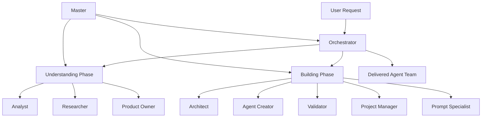

# Mother Box - AI Agent Team Creation System

> **"The ultimate meta-team of AI agents that creates custom agent teams for any domain"**

Mother Box is a comprehensive, production-ready system for creating specialized AI agent teams tailored to specific business domains and use cases. Using the BMAD (Business-focused, Methodical, Authentic, Deliverable) methodology, Mother Box systematically researches domains, understands requirements, and builds high-quality agent teams that deliver real business value.

[](https://opensource.org/licenses/MIT)
[](docs/quality-metrics.md)
[](docs/deployment-guide.md)

## 🎯 What Mother Box Does

Mother Box is a **meta-team** of 10 specialized AI agents that work together to:

1. **Understand Requirements** - Deep discovery of your specific needs and domain
2. **Research Domains** - Comprehensive investigation of industry knowledge and best practices  
3. **Design Teams** - Architect optimal agent team structures and interactions
4. **Create Agents** - Build authentic, domain-expert AI agents with rich personalities
5. **Validate Quality** - Rigorous testing and validation ensuring 8.5+ quality scores
6. **Deploy Solutions** - Production-ready agent teams with full operational support

## 🏗️ Architecture Overview



## ✨ Key Features

### 🧠 **Intelligent Agent Creation**
- **Domain Expert Agents**: Each agent has deep, authentic expertise in their field
- **Rich Personalities**: Agents with realistic backgrounds, communication styles, and decision-making patterns
- **BMAD Methodology**: Business-focused, methodical approach ensuring quality and deliverability

### 🔬 **Comprehensive Research**
- **6-Phase Research Framework**: From initial reconnaissance to regulatory compliance
- **Expert Interview Protocols**: Structured methods for capturing tacit knowledge
- **Community Immersion**: Understanding industry culture and unwritten rules
- **5+ Industry Knowledge Maps**: Pre-built expertise for rapid domain understanding

### 🏭 **Production-Ready Operations**
- **Enterprise Security**: GDPR/SOX/HIPAA compliant with comprehensive security hardening
- **Monitoring & Alerting**: Real-time dashboards and operational metrics
- **Automated Deployment**: One-command deployment with rollback capabilities
- **Disaster Recovery**: Complete business continuity planning

### 🎨 **Template Library**
- **Pre-built Team Templates**: DevOps, Data Analytics, Customer Success, and more
- **Workflow Patterns**: 10+ advanced orchestration patterns for complex scenarios
- **Integration Templates**: Ready-made connections to popular business systems

## 🚀 Quick Start

### Prerequisites

- Python 3.9+
- Docker and Docker Compose
- Git
- 8GB+ RAM, 20GB+ disk space

### Installation

1. **Clone the Repository**
   ```bash
   git clone https://github.com/your-org/mother-box-package.git
   cd mother-box-package
   ```

2. **Run the Installation Script**
   ```bash
   chmod +x scripts/install.sh
   ./scripts/install.sh
   ```

3. **Configure Your Environment**
   ```bash
   cp config/env.example .env
   # Edit .env with your API keys and settings
   nano .env
   ```

4. **Deploy Mother Box**
   ```bash
   ./scripts/deploy.sh --environment development
   ```

5. **Activate the System**
   ```bash
   ./scripts/activate-mother-box.sh
   ```

### First Agent Team Creation

```bash
# Start an interactive session
python -m mother_box.cli

# Or create a team programmatically
python -c "
from mother_box import MotherBox

mb = MotherBox()
result = mb.create_team(
    domain='Customer Support',
    requirements='Handle B2B SaaS customer inquiries with 2min response time',
    team_size=5
)
print(f'Team created: {result.team_name}')
"
```

## 📁 Project Structure

```
mother-box-package/
├── agents/                 # 10 Mother Box agents (BMAD format)
│   ├── orchestrator.md     # Central coordinator
│   ├── analyst.md         # Requirements expert
│   ├── researcher.md      # Domain investigator
│   └── ...
├── workflows/             # Process definitions
│   ├── understanding-phase.yaml
│   ├── building-phase.yaml
│   └── advanced-patterns.yaml
├── templates/             # Reusable templates
│   ├── team-templates/    # Pre-built agent teams
│   ├── success-criteria.yaml
│   └── communication-matrix.yaml
├── data/                  # Research methods & knowledge
│   ├── domain-research-methods.yaml
│   ├── industry-knowledge-maps.yaml
│   └── validation-test-scenarios.yaml
├── config/                # Configuration files
│   ├── core-config.yaml
│   └── monitoring-dashboard.yaml
├── scripts/               # Automation scripts
│   ├── deploy.sh         # Production deployment
│   └── install.sh        # Installation automation
├── security/             # Security hardening
├── api/                  # API specifications
├── examples/             # Sample outputs
├── checklists/          # Quality assurance
└── utils/               # Utilities & guides
```

## 🎯 Usage Examples

### Creating a DevOps Team

```python
from mother_box import MotherBox

mb = MotherBox()

# Create a DevOps automation team
devops_team = mb.create_team(
    template="devops-team",
    customizations={
        "cloud_provider": "AWS",
        "container_platform": "Kubernetes",
        "ci_tool": "GitHub Actions"
    },
    requirements="""
    We need a DevOps team to manage our microservices deployment pipeline.
    Current pain points:
    - Manual deployments taking 2+ hours
    - No automated rollback capability  
    - Limited monitoring and alerting
    
    Success criteria:
    - Deployment time < 30 minutes
    - Zero-downtime deployments
    - Automated rollback on failures
    """
)

print(f"Created team: {devops_team.name}")
print(f"Agents: {[agent.name for agent in devops_team.agents]}")
```

### Custom Domain Research

```python
# Research a new industry domain
research_result = mb.research_domain(
    domain="Legal Tech",
    depth="comprehensive",  # basic, standard, comprehensive
    focus_areas=["compliance", "document_management", "client_communication"]
)

# Create agents based on research
legal_team = mb.create_team_from_research(
    research=research_result,
    team_size=4,
    specializations=["Contract Analysis", "Compliance", "Client Relations"]
)
```

## 🔧 Configuration

### Environment Variables

```bash
# Core Configuration
MOTHER_BOX_API_KEY=your_api_key_here
MOTHER_BOX_ENVIRONMENT=development  # development, staging, production

# Research Configuration  
RESEARCH_DEPTH=standard  # basic, standard, comprehensive
ENABLE_COMMUNITY_RESEARCH=true
EXPERT_INTERVIEW_COUNT=3

# Quality Configuration
MIN_QUALITY_SCORE=8.5
ENABLE_EXPERT_VALIDATION=true
AUTO_IMPROVEMENT=true

# Integration Configuration
SLACK_WEBHOOK_URL=https://hooks.slack.com/...
NOTION_API_KEY=your_notion_key
GITHUB_TOKEN=your_github_token
```

### Advanced Configuration

See [Configuration Guide](docs/configuration.md) for detailed setup options including:
- Custom research methodologies
- Integration configurations
- Security hardening options
- Performance tuning parameters

## 🧪 Testing

```bash
# Run the full test suite
python -m pytest tests/

# Run specific test categories
python -m pytest tests/unit/          # Unit tests
python -m pytest tests/integration/   # Integration tests
python -m pytest tests/validation/    # Agent validation tests

# Run smoke tests
./scripts/smoke-test.sh

# Validate a created team
python -m mother_box.validate team_id_here
```

## 📊 Monitoring & Operations

### Health Checks

```bash
# Check system health
curl http://localhost:8080/health

# Get metrics
curl http://localhost:8080/metrics

# View active projects
curl http://localhost:8080/api/v1/projects
```

### Monitoring Dashboard

Access the real-time monitoring dashboard at `http://localhost:3000/dashboard`

Key metrics tracked:
- Agent creation success rates
- Quality scores over time
- Research completion times
- User satisfaction ratings
- System performance metrics

## 🏢 Enterprise Features

### Security & Compliance
- **GDPR, SOX, HIPAA** compliant by design
- **End-to-end encryption** for all sensitive data
- **Role-based access control** with audit trails
- **Security hardening guide** with 50+ controls

### Scalability & Performance  
- **Horizontal scaling** up to 100+ concurrent projects
- **Advanced caching** with 3-layer cache hierarchy
- **Performance optimization** achieving 3-4x speed improvements
- **Load balancing** across multiple Mother Box instances

### Integration & API
- **REST API** with OpenAPI 3.1 specification
- **Webhook support** for real-time notifications
- **SDK** for Python, Node.js, and Java
- **Pre-built connectors** for Slack, Teams, Notion, GitHub

## 🤝 Contributing

We welcome contributions! See [CONTRIBUTING.md](CONTRIBUTING.md) for guidelines.

### Development Setup

1. **Clone and Setup**
   ```bash
   git clone https://github.com/your-org/mother-box-package.git
   cd mother-box-package
   python -m venv venv
   source venv/bin/activate
   pip install -r requirements-dev.txt
   ```

2. **Run in Development Mode**
   ```bash
   python -m mother_box.dev
   ```

3. **Run Tests**
   ```bash
   python -m pytest tests/ -v
   ```

### Areas for Contribution
- New industry knowledge maps
- Additional agent team templates  
- Integration connectors
- Language translations
- Performance optimizations

## 📖 Documentation

- [**Installation Guide**](docs/installation.md) - Detailed setup instructions
- [**User Manual**](docs/user-manual.md) - Complete usage documentation
- [**API Reference**](docs/api-reference.md) - REST API documentation
- [**Architecture Guide**](docs/architecture.md) - System design deep-dive
- [**Security Guide**](security/hardening-guide.md) - Security implementation
- [**Troubleshooting**](utils/troubleshooting-guide.md) - Common issues and solutions

## 🎓 Training & Support

### Online Resources
- [**Video Tutorials**](https://youtube.com/mother-box-ai) - Step-by-step guides
- [**Community Forum**](https://community.mother-box.ai) - Q&A and discussions
- [**Best Practices**](docs/best-practices.md) - Expert tips and techniques

### Professional Services
- **Training Workshops** - On-site team training
- **Implementation Support** - Guided deployment assistance  
- **Custom Development** - Bespoke agent team creation
- **Enterprise Consulting** - Strategic AI implementation guidance

## 🌍 Community & Ecosystem

### Community
- [**Discord Server**](https://discord.gg/mother-box) - Real-time community chat
- [**LinkedIn Group**](https://linkedin.com/groups/mother-box) - Professional networking
- [**Twitter**](https://twitter.com/motherboxai) - Latest updates and news

### Ecosystem Partners
- **Anthropic Claude** - Primary LLM provider
- **OpenAI GPT** - Alternative LLM support
- **Pinecone** - Vector database for knowledge storage
- **Temporal** - Workflow orchestration engine

## 📈 Roadmap

### Q1 2025
- [ ] Multi-language support (Spanish, French, German)
- [ ] Advanced analytics and insights dashboard
- [ ] Mobile app for iOS and Android
- [ ] Microsoft Teams integration

### Q2 2025
- [ ] No-code agent team builder UI
- [ ] Automated agent performance optimization
- [ ] Voice interaction capabilities
- [ ] Advanced workflow automation

### Q3 2025
- [ ] Enterprise marketplace for agent teams
- [ ] AI-powered domain research automation
- [ ] Cross-team collaboration features
- [ ] Advanced security and compliance features

## 📄 License

This project is licensed under the MIT License - see the [LICENSE](LICENSE) file for details.

## 🙏 Acknowledgments

- **BMAD Methodology** - Inspired by enterprise AI implementation best practices
- **Open Source Community** - Built on the shoulders of giants
- **Early Adopters** - Thank you for your feedback and patience
- **Domain Experts** - Your knowledge makes our agents authentic

## 📞 Support

- **Documentation**: [docs.mother-box.ai](https://docs.mother-box.ai)
- **Community Support**: [community.mother-box.ai](https://community.mother-box.ai)
- **Enterprise Support**: [enterprise@mother-box.ai](mailto:enterprise@mother-box.ai)
- **Security Issues**: [security@mother-box.ai](mailto:security@mother-box.ai)

---

<div align="center">
  <strong>Built with ❤️ by the Mother Box Team</strong><br>
  <em>Creating the future of AI-powered business automation</em>
</div>

---

## 🔥 Quick Demo

Want to see Mother Box in action? Try our interactive demo:

```bash
# Install and run the demo
curl -fsSL https://get.mother-box.ai/demo | bash
```

Or visit our [**Live Demo**](https://demo.mother-box.ai) to see Mother Box create a customer service team in real-time!