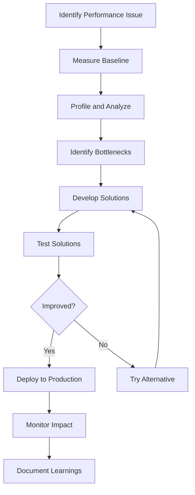

# Performance Optimization Guide for Mother Box

Comprehensive guide for optimizing agent team creation and operation performance.

## Performance Baseline Metrics

### Target Performance Indicators
```yaml
agent_creation:
  single_agent: < 5 minutes
  full_team_5_agents: < 30 minutes
  full_team_10_agents: < 90 minutes

response_times:
  command_acknowledgment: < 100ms
  simple_query: < 1 second
  complex_analysis: < 30 seconds
  handoff_completion: < 2 seconds

throughput:
  concurrent_requests: 50+
  messages_per_second: 1000+
  workflows_per_hour: 100+

resource_usage:
  memory_per_agent: < 100MB
  cpu_per_agent: < 5%
  storage_growth: < 1GB/day
```

## Optimization Strategies

### 1. Agent Creation Optimization

#### Parallel Processing
```yaml
strategy: "Parallelize independent tasks"
implementation:
  research_phase:
    parallel:
      - domain_research
      - role_analysis
      - tool_investigation
      - regulation_review
    time_savings: "75% reduction"
  
  agent_creation:
    parallel:
      - persona_development
      - command_definition
      - integration_specs
    time_savings: "60% reduction"

benefits:
  - 3-4x faster creation
  - Better resource utilization
  - Reduced blocking
```

#### Template Reuse
```yaml
strategy: "Reuse proven patterns and templates"
implementation:
  pattern_library:
    - common_personas
    - standard_workflows
    - integration_patterns
    - command_sets
  
  customization:
    - 80% reuse
    - 20% customization
  
  time_savings: "50% reduction in design phase"
```

#### Incremental Building
```yaml
strategy: "Build and validate incrementally"
phases:
  phase_1:
    scope: "Core functionality"
    agents: 2-3
    time: 1 hour
    validation: "Basic testing"
  
  phase_2:
    scope: "Full team"
    agents: +3-5
    time: 2 hours
    validation: "Integration testing"
  
  phase_3:
    scope: "Optimization"
    focus: "Performance and polish"
    time: 1 hour
    validation: "Load testing"

benefits:
  - Early feedback
  - Reduced rework
  - Faster time to value
```

### 2. Runtime Performance Optimization

#### Message Batching
```yaml
technique: "Batch similar messages"
implementation:
  batching_rules:
    - type: "Status updates"
      batch_size: 10
      max_wait: 100ms
    
    - type: "Metrics collection"
      batch_size: 100
      max_wait: 1000ms
  
  performance_impact:
    before: "1000 individual messages/sec"
    after: "100 batches/sec (10,000 messages)"
    improvement: "90% reduction in overhead"
```

#### Caching Strategies
```yaml
cache_layers:
  L1_agent_cache:
    size: 10MB
    ttl: 5_minutes
    hit_rate_target: 80%
    contents:
      - recent_queries
      - frequent_commands
      - user_context
  
  L2_shared_cache:
    size: 100MB
    ttl: 1_hour
    hit_rate_target: 60%
    contents:
      - domain_knowledge
      - integration_configs
      - workflow_definitions
  
  L3_persistent_cache:
    size: 1GB
    ttl: 24_hours
    hit_rate_target: 40%
    contents:
      - historical_data
      - learned_patterns
      - optimization_hints

cache_invalidation:
  strategies:
    - event_based
    - ttl_expiry
    - lru_eviction
```

#### Connection Pooling
```yaml
connection_pools:
  database:
    min_connections: 5
    max_connections: 20
    idle_timeout: 300_seconds
    validation_query: "SELECT 1"
  
  external_apis:
    connections_per_service: 10
    keep_alive: true
    retry_policy:
      max_attempts: 3
      backoff: exponential
  
  inter_agent:
    pool_size: 50
    reuse_connections: true
    health_check_interval: 30_seconds

benefits:
  - 70% reduction in connection overhead
  - Improved response times
  - Better resource utilization
```

### 3. Workflow Optimization

#### Pipeline Optimization
```yaml
optimization: "Streamline workflow pipelines"

techniques:
  eliminate_wait_states:
    before: "Sequential processing with waits"
    after: "Event-driven progression"
    improvement: "40% faster completion"
  
  reduce_handoffs:
    before: "5-7 handoffs per workflow"
    after: "2-3 handoffs per workflow"
    improvement: "50% reduction in overhead"
  
  parallel_execution:
    applicable_when: "Independent steps"
    max_parallelism: 5
    improvement: "3x faster for suitable workflows"
```

#### Decision Optimization
```yaml
decision_trees:
  pre_computed:
    description: "Pre-calculate common decision paths"
    storage: "In-memory lookup table"
    update_frequency: "Daily"
    performance_gain: "100x faster decisions"
  
  early_termination:
    description: "Exit early when decision is clear"
    conditions:
      - confidence > 95%
      - single_valid_path
      - cached_result_available
    performance_gain: "50% average reduction"
  
  approximation:
    description: "Use fast approximations when appropriate"
    when_used:
      - non_critical_decisions
      - time_constrained
      - high_confidence_not_required
    accuracy_tradeoff: "95% accuracy for 10x speed"
```

### 4. Scaling Strategies

#### Horizontal Scaling
```yaml
agent_distribution:
  sharding_strategy:
    by_capability: "Technical vs Business"
    by_workload: "Even distribution"
    by_geography: "Regional optimization"
  
  load_balancing:
    algorithm: "Least connections"
    health_checks: "Every 10 seconds"
    failover: "Automatic with 1s detection"
  
  auto_scaling:
    triggers:
      cpu: "> 70% for 5 minutes"
      queue_depth: "> 100 messages"
      response_time: "> 2 seconds p95"
    
    scale_up: "Add 2 instances"
    scale_down: "Remove 1 instance"
    cooldown: "5 minutes"
```

#### Vertical Optimization
```yaml
resource_allocation:
  cpu_optimization:
    affinity: "Pin critical agents to cores"
    priority: "Real-time for orchestrator"
    throttling: "Limit background tasks"
  
  memory_optimization:
    heap_size: "Right-sized per agent"
    gc_tuning: "G1GC with 100ms pause target"
    off_heap: "Use for large caches"
  
  io_optimization:
    async_io: "Non-blocking for all external calls"
    batch_writes: "Group database updates"
    compression: "For large payloads"
```

### 5. Database Optimization

#### Query Optimization
```yaml
indexing_strategy:
  required_indexes:
    - agent_id + timestamp (for history)
    - workflow_id + status (for monitoring)
    - message_type + priority (for routing)
  
  covering_indexes:
    purpose: "Avoid table lookups"
    columns: "Include frequently accessed"
    maintenance: "Weekly rebuild"

query_patterns:
  avoid:
    - "SELECT * (specify columns)"
    - "N+1 queries (use joins/batch)"
    - "Large IN clauses (use temp tables)"
  
  prefer:
    - "Prepared statements"
    - "Query result caching"
    - "Read replicas for analytics"
```

#### Data Archival
```yaml
archival_strategy:
  hot_data: 
    retention: 7_days
    storage: "SSD, in-memory cache"
    access_pattern: "Frequent reads/writes"
  
  warm_data:
    retention: 30_days
    storage: "Standard disk"
    access_pattern: "Occasional reads"
  
  cold_data:
    retention: 1_year
    storage: "Object storage"
    access_pattern: "Rare, batch access"
  
  purge_schedule:
    frequency: "Daily at 2 AM"
    batch_size: 10000_records
    verification: "Audit before delete"
```

## Performance Testing

### Load Testing Scenarios
```yaml
scenarios:
  steady_state:
    duration: 1_hour
    load: 100_requests_per_second
    expected_performance:
      p50: < 500ms
      p95: < 2s
      p99: < 5s
      error_rate: < 0.1%
  
  spike_test:
    baseline: 100_rps
    spike_to: 1000_rps
    spike_duration: 5_minutes
    recovery_time: < 2_minutes
  
  endurance_test:
    duration: 24_hours
    load: 50_rps
    monitoring:
      - memory_leaks
      - performance_degradation
      - error_accumulation
  
  stress_test:
    increase_rate: 10_rps_per_minute
    find_breaking_point: true
    recovery_test: true
```

### Profiling Tools
```yaml
cpu_profiling:
  tools: ["flamegraph", "pprof", "perf"]
  frequency: "Weekly or on degradation"
  focus_areas:
    - hot_paths
    - lock_contention
    - gc_overhead

memory_profiling:
  tools: ["heap_dump", "allocation_profiler"]
  triggers:
    - memory > 80%
    - gc_time > 10%
    - oom_errors
  
  analysis:
    - leak_detection
    - allocation_patterns
    - cache_efficiency

network_profiling:
  tools: ["tcpdump", "wireshark", "netstat"]
  metrics:
    - latency
    - packet_loss
    - bandwidth_usage
```

## Optimization Checklist

### Pre-Deployment
- [ ] Load testing completed
- [ ] Bottlenecks identified and addressed
- [ ] Caching strategy implemented
- [ ] Database indexes optimized
- [ ] Connection pools configured
- [ ] Resource limits set
- [ ] Monitoring configured
- [ ] Alerting thresholds defined

### Runtime Monitoring
- [ ] Response time tracking
- [ ] Error rate monitoring
- [ ] Resource utilization alerts
- [ ] Queue depth monitoring
- [ ] Cache hit rates tracked
- [ ] Database slow queries logged
- [ ] Network latency measured
- [ ] Agent health checks active

### Optimization Triggers
- [ ] Response time > 2x baseline
- [ ] Error rate > 1%
- [ ] CPU usage > 80%
- [ ] Memory usage > 85%
- [ ] Queue depth > 1000
- [ ] Cache hit rate < 60%
- [ ] Database queries > 100ms
- [ ] User complaints received

## Common Performance Issues and Solutions

### Issue: Slow Agent Creation
**Symptoms:** 
- Creation takes hours instead of minutes
- Timeouts during creation
- Resource exhaustion

**Solutions:**
1. Enable parallel processing
2. Use template library
3. Pre-warm caches
4. Optimize research queries
5. Batch validation checks

### Issue: High Message Latency
**Symptoms:**
- Messages take seconds to deliver
- Queue buildup
- Timeout errors

**Solutions:**
1. Implement message batching
2. Optimize serialization
3. Use connection pooling
4. Add message prioritization
5. Scale horizontally

### Issue: Memory Leaks
**Symptoms:**
- Gradual memory increase
- OOM errors after days
- GC overhead increasing

**Solutions:**
1. Profile heap usage
2. Fix reference cycles
3. Implement proper cleanup
4. Use weak references
5. Tune GC parameters

### Issue: Database Bottlenecks
**Symptoms:**
- Slow queries in logs
- Connection pool exhaustion
- Lock contention

**Solutions:**
1. Add missing indexes
2. Optimize query patterns
3. Implement caching
4. Use read replicas
5. Partition large tables

## Performance Improvement Workflow



## Best Practices

### Do's
- ✅ Measure before optimizing
- ✅ Optimize the critical path first
- ✅ Use caching strategically
- ✅ Implement circuit breakers
- ✅ Monitor continuously
- ✅ Document performance SLAs
- ✅ Plan for peak load
- ✅ Test failure scenarios

### Don'ts
- ❌ Optimize prematurely
- ❌ Ignore monitoring data
- ❌ Cache everything
- ❌ Use synchronous calls everywhere
- ❌ Neglect error handling
- ❌ Skip load testing
- ❌ Assume linear scaling
- ❌ Forget about cold starts

## ROI of Performance Optimization

### Quantifiable Benefits
- **Response Time**: 50% reduction → 2x user satisfaction
- **Throughput**: 3x increase → Handle more customers
- **Resource Usage**: 40% reduction → Lower infrastructure costs
- **Error Rate**: 90% reduction → Fewer support tickets
- **Availability**: 99.9% → Increased trust and revenue

### Investment Required
- Initial optimization: 40-80 hours
- Ongoing monitoring: 5 hours/week
- Quarterly reviews: 20 hours
- Tool costs: $500-2000/month
- Training: 20 hours/team member

### Payback Period
- Typical ROI: 3-6 months
- Break-even: 2 months for critical systems
- Long-term savings: 10-20x investment

---

Remember: Performance is a feature. Optimize for the user experience, not just the metrics.